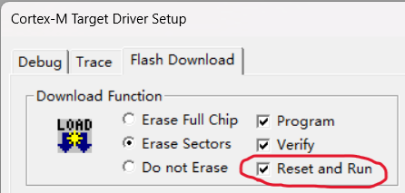

# 附录

- [附录](#附录)
  - [1 代码编写](#1-代码编写)
    - [1.1 编辑器与IDE的选择](#11-编辑器与ide的选择)
    - [1.2 代码格式](#12-代码格式)
    - [1.3 编辑代码](#13-编辑代码)
  - [2 科学调参](#2-科学调参)
    - [2.1 信号发生器的使用](#21-信号发生器的使用)
  - [3 部分问题及解决方案](#3-部分问题及解决方案)
    - [3.1 Cortex\_M4 报错](#31-cortex_m4-报错)
    - [3.2 电脑连接了自定义控制器但一直显示离线](#32-电脑连接了自定义控制器但一直显示离线)

## 1 代码编写

### 1.1 编辑器与IDE的选择

- **IDE : Keil5**
- **编辑器 : VSCode**

为了方便大家进行环境配置，本项目使用Keil5所带的armcc工具链进行编译，可用完美适配官代。在熟悉官代后可以轻松转移到本项目中进行编辑。

- 关于keil5，经典IDE，环境配置极为方便，对STM系列芯片使用者极为友好
- 关于VSCode，现代化代码编辑器（其实就是一高级版的文本编辑器），支持各种插件进行功能拓展，能极高的提高大家的工作效率。

### 1.2 代码格式

本项目代码格式主要基于Google风格，具体的格式配置信息请参照 [.clang-format](../.clang-format) 文件

- **如何格式化你的代码：** 右键选择 `格式化代码` （默认快捷键 `Shift + Alt + F`）
- **如何在部分区域禁用格式化：** \
    在区域开始的位置添加注释

    ```C
    // clang-format off
    ```

    在区域结束的位置添加注释

    ```C
    // clang-format on
    ```

    这样在格式化代码的时候就不会使用 [.clang-format](../.clang-format) 格式化这部分代码而保持原有风格了。

    > **关于禁用格式化的作用：** 部分地方由于格式化之后变成奇怪格式效果，这时候可以禁用格式化来保持我们所需要的格式。

### 1.3 编辑代码

## 2 科学调参

### 2.1 信号发生器的使用

<!-- ## 3 部分代码解释
### data_exchange
数据交换中心的作用是为了方便在各个模块之间交换数据， -->

## 3 部分问题及解决方案

### 3.1 Cortex_M4 报错

如在烧录代码时出现 Cortex_M4 的报错


请在魔术棒中


打开 `Utilities` 选项卡，点击 `Settings` 按钮


勾选 `reset and run` 选项



### 3.2 电脑连接了自定义控制器但一直显示离线

解决方案：\
安装相关驱动(以下内容来源于选手端的README，根目录为选手端文件夹)

1. 如果打不开串口，需要安装选手端自带的net7.0与VS运行环境，\
     路径为：`RoboMasterClient\RoboMasterClient_Data\StreamingAssets\Tools\dotnet-runtime-7.0.4-win-x64.exe`\
     路径为：`RoboMasterClient\RoboMasterClient_Data\StreamingAssets\Tools\VC2015~2019_redist.x64.exe`
2. 如果打不开自定义控制器，安装自定义控制器驱动\
     路径为：`RoboMasterClient\RoboMasterClient_Data\StreamingAssets\Tools\Windows_CDM21228_Setup.exe`
